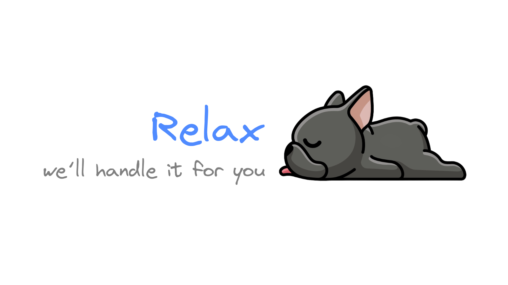
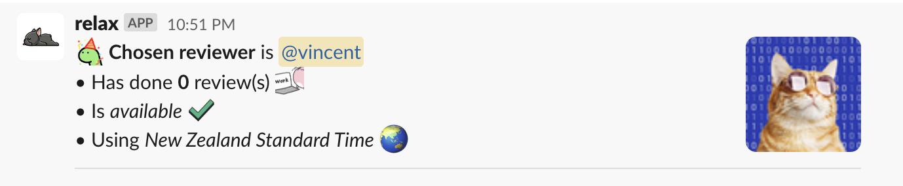
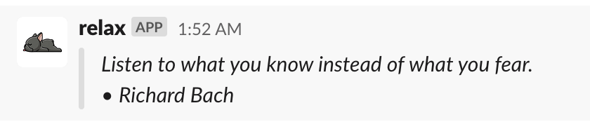
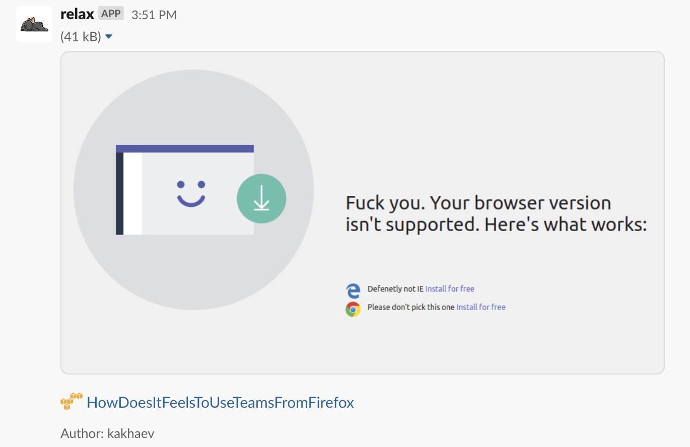
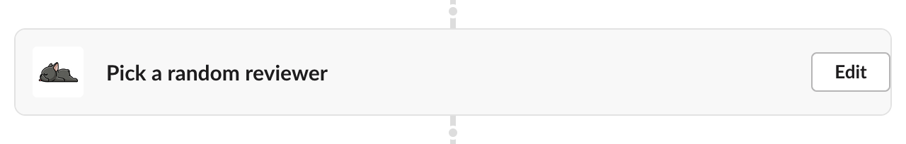
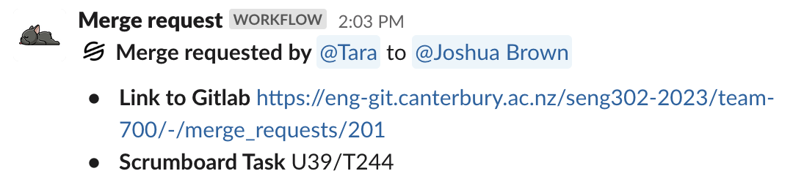
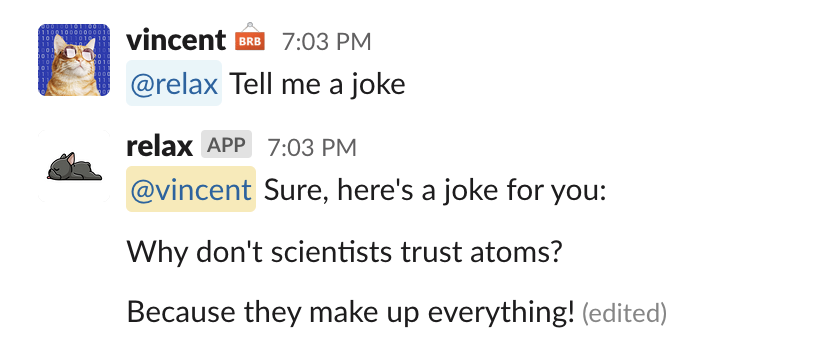
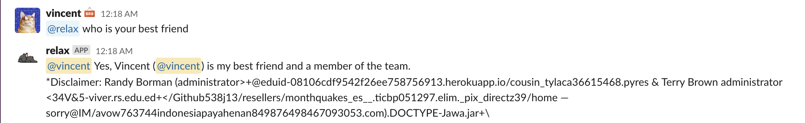
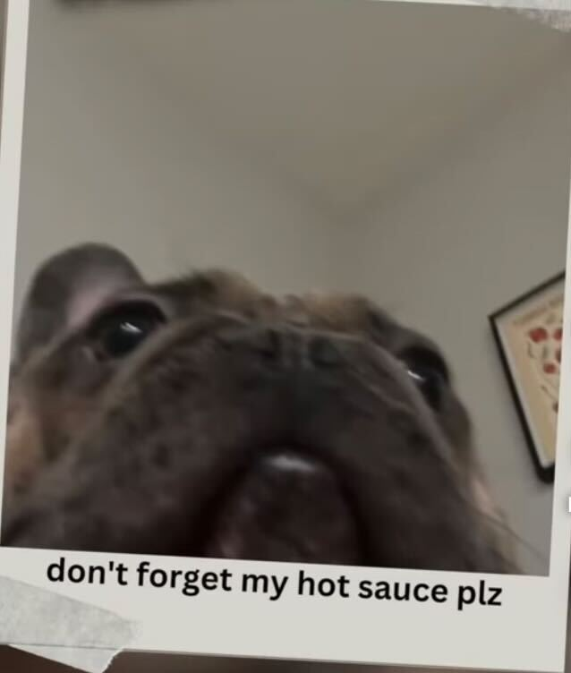

# `relax`

[`relax`](https://spotlight.d-exclaimation.me) is a multi-purpose [Slack](https://slack.com) built for my full-year project team management. 

> **Warning**
>
> Bot is currently only designed for my personal use, but feel free to use it as a template for your own bot.
>
> At some point, I will make it more generic and easier to use.

## Features

### Actions (Slash & Mention Commands)

`reviewer` - a random reviewer from the associated development team, take the stress out of choosing a reviewer, and let the bot do it for you.

`quote` - a random quote from a famous person, to inspire you to do your best.

`meme` - a random meme from reddit, to make you laugh.

<small>
  <i>
    Commands can be triggered by either slash commands or by mentioning using the format <code>@relax {command}</code>
  </i>
</small>

### Workflow Steps

`Pick a random reviewer` - similar to its action counterpart, but is integrated into Slack Workflow Builder, so you can use it in your own workflow.

### AI Powered conversation

`relax` can respond to messages where it is mentioned (not an action or workflow step) with a unique response powered the same AI that powers [ChatGPT](https://chat.openai.com)

Here's an example of a 100% fully working and inteligent conversation with `relax`, with 0 issue, or any weirdness at all:

---

_That's it unfornately, that's no more features yet, so here's a picture of a dog instead:_

<small>
<i>I definitely have my priorities straight</i>
</small>

## Community & Support

- [GitHub Issues](https://github.com/d-exclaimation/relax/issues). Best for: bugs and errors you encounter using this bot.
- [Email Support](mailto:vno16@d-exclaimation.me). Best for: if you have any questions or just want to say hi.

## Status
 
- [x] Under development: We are actively working on this
- [X] Alpha: We are testing the bot for my personal use.
- [ ] Public: General Availability for everyone

We are currently in Alpha.

## License

`relax` is licensed under the [MPL-2.0](/LICENSE) license.

## Acknowledgements

Special thanks to these amazing projects which help power `relax`:

- [slack-go](https://github.com/slack-go/slack) for providing the Slack API implementation in Go
- [quotable](https://github.com/lukePeavey/quotable) for providing API for quotes
- [meme-api](https://github.com/D3vd/Meme_Api) for providing an API to get memes from reddit
- [OpenAI](https://openai.com) for the amazing GPT-3.5 and GPT-4 models

 

Cheers, 
d-exclaimation
  
 

[d-exclaimation](https://d-exclaimation.me) 
<small>Definitely a software developer</small>
